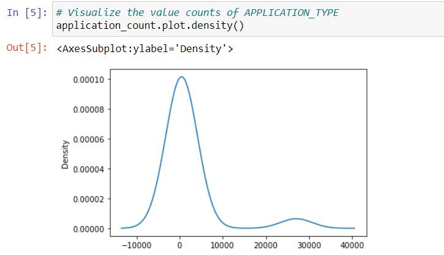

# Neural_Network_Charity_Analysis
## Introduction
This project is for Alphabet Soup company. They have provided a CSV containing more than 34,000 organizations that have received funding for their company over the years. ** This project uses machine learning and neural networks with TensorFlow platform in Python to create binary classifier that is capable of predicting whether applications will be successful if funded by Alphabet Soup.**

## Results
### Data Preprocessing 
•	What variable(s) are considered the target(s) for your model?
The target model for this project is IS_SUCCESSFUL.
•	What variable(s) are considered to be the features for your model?
The following are varriables that are considered to be features in the model: ASK_AMT, CLASSIFICATION, USE_CASE, STATUS, INCOME_AMT, SPECIAL_CONSIDERATIONS, ORGANIZATION, APPLICATION_TYPE, and AFFILIATION.
•	What variable(s) are neither targets nor features, and should be removed from the input data?
Both IN and Name are neither targets nor features. They are identification information and were not used in the analysis.
	### Example of results

### Compiling, Training, and Evaluating the Model 
•	How many neurons, layers, and activation functions did you select for your neural network model, and why?
Neurons: 80 and 30
Layers and activation functions: 25,724 samples input and 43 features.
•	Were you able to achieve the target model performance?
No, the accuracy was below the target of 75%.
•	What steps did you take to try and increase model performance?
Implementation of ASK_AMT bucketing features to organize different values by intervals. 

## Summary
Overall, this machine learning model did not mee the target accuracy, suggesting that improvements need to be made. Firstly, implementation of Random Forest Classifier from supervised machine learning model in combination with decision tress may increase the accuracy of prediction of charity donation. Lastly, increasing the layers may also increase the accuracy. 
